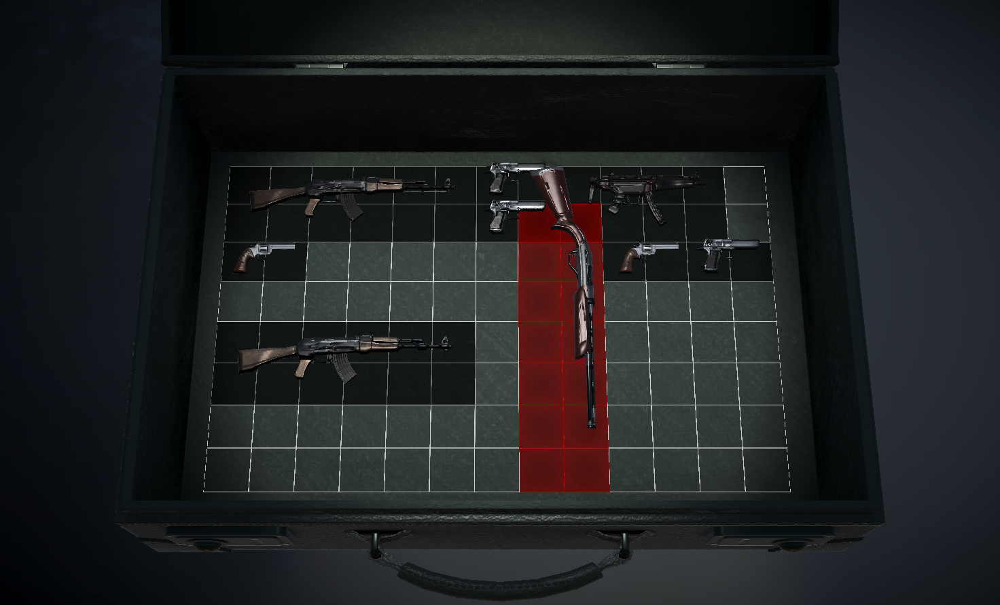

# Resident Evil 4 Remake | Grid Inventory

RE 4 Remake inventory clone remade in Unity. Thanks to [Rod Amorin](https://github.com/rod-amorim/ResidentEvil4InventorySystemUnityClone) for his take on the inventory, looking at his work served as a base to start off mine.

## First Steps
### Unity Version
- Made with Unity 6000.2.f11
### How to
Inventory is self-contained in the Main scene hierarchy, in the object called Grid(Inventory), you should be able to press Play and control the inventory using:
- **WASD or arrow keys** to **move**
- **Left click** to **grab/drop**
- **R** to **rotate**

## Assets used
- Visual Assets used are from Unity's Asset Store
- SFX and background music are extracted from Resident Evil 4 Remake videogame.

## Authors
- **Santiago Meneses Gómez** - [Github](https://github.com/popieyes)
